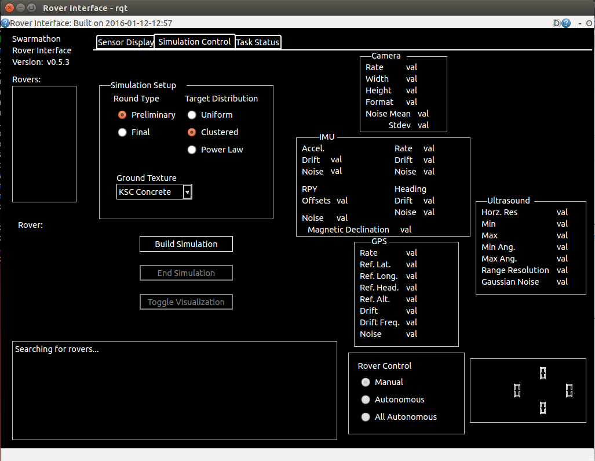

# University of Houston | ECE                                                                                 
# ECE 5397/6397: Introduction to Robotics                                                                      
# Spring 2016

* **Instructor**:  Dr. Aaron T. Becker
* **Teaching Assistant**: Li Huang
* **Author**: An Nguyen, anguyen43@uh.edu
* **Due**:
* **Purpose**: For students to explore the [Swarmathon-ROS][swarmathon_ros] simulation running on ROS. Applying knowledge gained from the [ROS beginner tutorials][ros_tutor] to explore the structure of the Swarmathon ROS simulation.
* **Pre Requisite**: The Swarmathon ROS simulation need to be running using the `./run.sh` command and a simulation need to be generated and running using the "Build Simulation" button on the "Simulation Control" tab (see image). The `run.sh` command only opens up the GUI for the simulation, the simulation only runs after you pressed the "Build Simulation" button.

	Students need to contact An Nguyen (anguyen43@uh.edu) as soon as possible if they are not able to run the simulation.

1. What's the message prototype of `geometry_msgs::Twist` `geometry_msgs:pose`  
	*hint*: Use the `rosmsg` command from [this tutorial][ros_tutor_1]

1. Draw a free body diagram representations of the elements of these messages (best educated guess)

1. What node publishes and subscribes to `/robot_name/targets` `/targetscollected`?  
	*hint*: Use the `rostopic` or `rosnode` command. [tutorial][ros_tutor_node], [rosnode][ros_rosnode], [rostopic][ros_rostopic]. Use the `info` arguement

1. In the `mobility.cpp` file, what variable determine the frequency of `mobilityStateMachine`?

1. If the variable is `(float)0.1`, how often does `mobilityStateMachine` run?

**Note**: These next questions are asked in an exploratory spirit. Designed to get the students to explore the Swarmathon ROS code base. They only need your best educated guesses, discussion with other students are encouraged.

1. In `mobility.cpp` what would make the state machine go from `STATE_MACHINE_TRANSFORM` to `STATE_MACHINE_ROTATE` or `STATE_MACHINE_TRANSLATE`?

1. What condition changes the state machine from `STATE_MACHINE_ROTATE` to `STATE_MACHINE_TRANSLATE`?

1. What condition changes the state machine from `STATE_MACHINE_TRANSLATE` to `STATE_MACHINE_TRANSFORM`?

1. What condition activates the subscription handler function `obstacleHandler`?

1. What condition activates the subscription handler function `targetHandler`?

1. What condition activates the subscription handler function `targetsCollectedHandler`?

1. Draw a state machine diagram for the robot's general state machine, no need to consider target handling or collision handling.

1. Draw a state machine diagram for the target handling.

1. Draw a state machine diagram for the collision handling.

<!--Links-->
[ros_tutor_1]:http://wiki.ros.org/ROS/Tutorials/UnderstandingTopics
[ros_tutor_node]:http://wiki.ros.org/ROS/Tutorials/UnderstandingNodes
[ros_rosnode]:http://wiki.ros.org/rosnode
[ros_rostopic]:http://wiki.ros.org/rostopic
[swarmathon_ros]:https://github.com/BCLab-UNM/Swarmathon-ROS
[ros_tutor]:http://wiki.ros.org/ROS/Tutorials
